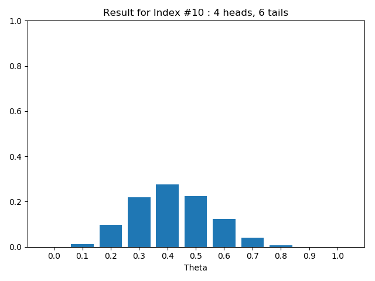

# Bayesian Estimation

## Requirements
- numpy
- matplotlib

## Initialize
`coins` : Number of coins

`theta` : Based on problem range(from 0 to 1.1 with 0.1 step)

`prior` : Chance of getting the same result

## Utilities
`flip_coins(coins)` : randomize flip coin either 1(heads) or 0(tails). Ex. When coins is 10 the output of the data is
`[ 0 1 0 1 0 0 0 0 1 0 ]`

`flip_coins_mainually` : Just return the array of heads and tails

## Likelihood
To get the likelihood, get the array of theta`[0.0 0.1 ... 1.0]` and loop thru each theta.

The formula is Theta to the power of heads multiply by 1 - theta to the power of tails
```python
heads = flip_coins_result[1]
tails = flip_coins_result[0]
    
for x in range(len(theta)):
        likelihood_result.append(math.pow(theta[x], heads) * math.pow(1 - theta[x], tails))
```

## Marginal Probability
The summation of all `likelihood * prior`
```python
np.sum(likelihood * prior)
```

## Posterior
Getting the Posterior, need to divide the Matrix of `Prior` and `Likelihood` by `Marginal Probability`
```python
np.true_divide(likelihood * prior, marginal_probability(likelihood, prior))
```

## Results

#### Prior a Flip Coins 2 Heads, 8 Tails

The Posterior tells us that the change of getting 2 heads and 8 tails is 20%.
But when it comes to likelihood, the chance of getting the same result is really difficult.
Therefore, predicting that the chance of getting next heads if 20%


#### Prior b Flip Coins 2 Heads, 8 Tails

By changing the prior to let the chance of 0.5 theta higher greatly change the result of posterior.
Even though the chances from 0.2 - 0.5 are near, there are still 30% chance of getting the right result.
Therefore, predicting the next heads is 30%


#### Prior a Simulates 50 times

Simulating the toss coins, because the conditional probability of the change of getting heads or tails is 50%
There are lots of result that's close to 4-6 or 5-5.

Hence, since each prior probability is the same, the chance of getting next coin with heads if 30 - 70%




#### Prior b Simulates 50 times

Simulation is the same as Prior a but the difference is the chance of each coins.
Since the prior of theta 0.5 is very high, therefore the prediction of 0.5 is very high. 


